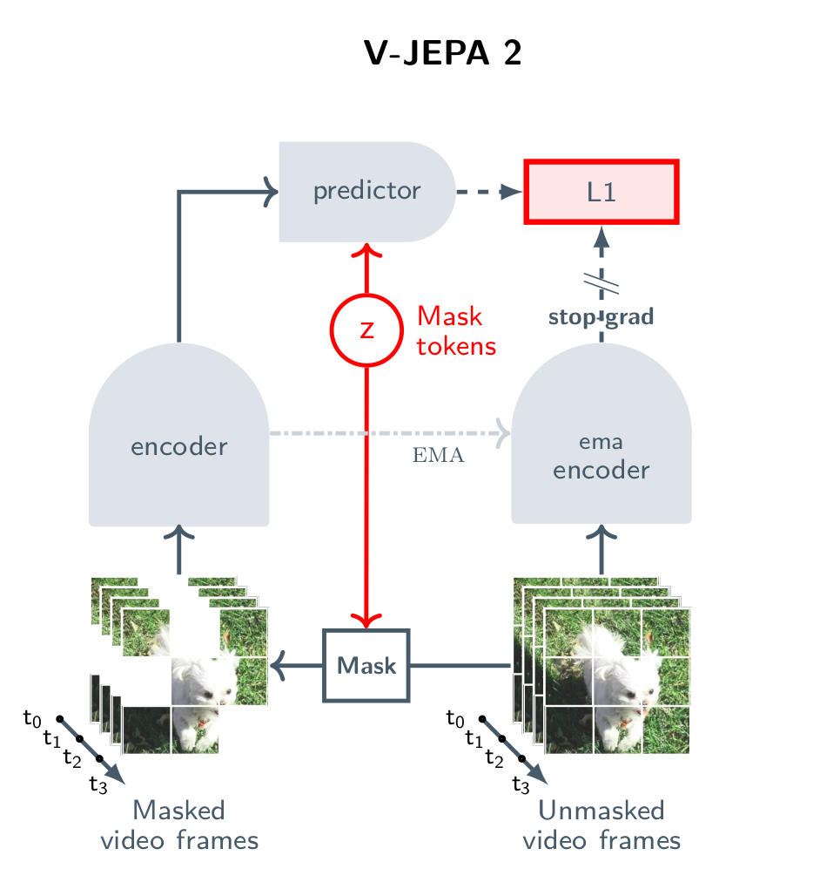

# V-JEPA-2-DeepSpeed: Deepspeed Implementation of V-JEPA 2


Deepspeed Implementation of V-JEPA 2 ( Vision-based Joint Embedding Predictive Architecture ) while maintaining legacy pytoch version code. Furthermore, we develop some tools to accelerate training model, evaluating model performance and easily monitor model training status.

V-JEPA 2 is a self-supervised approach to training video encoders, using internet-scale video data, that attains state-of-the-art performance on motion understanding and human action anticpation tasks. 

<p align="center">
	
</p>

<!---
## Updates

* **[Jun-6-25]:** V-JEPA 2 is released. [[`Blog`](https://ai.meta.com/blog/v-jepa-2-world-model-benchmarks)]
--->

## Project Resources
[[`Original Project`](https://github.com/facebookresearch/vjepa2)][[`Paper`](https://arxiv.org/abs/2506.09985)] [[`Blog`](https://ai.meta.com/blog/v-jepa-2-world-model-benchmarks)] [[`BibTex`](#Citation)]

## What's New Features In This Repo?
####    * Deepspeed implementation will save more GPUs and accelerate model training.
####    * Can train v-jepa 2 locally or in distributed parallel system with properly configuring model. 
####    * Detailed dataset processing which is easily used from scratch.
####    * Deeply integrated in original pytorch verion v-jepa 2.
####    * New developed tools to monitor gradient/feature norm std & mean.

##  Quick Start
You can train your v-jepa 2 on 2 RTX4090 GPUS, or even run on your laptop computer with >= 6 GB VRAM successfully.
### Setup

```
conda create -n vjepa2-312 python=3.12
conda activate vjepa2-312
pip install .  # or `pip install -e .` for development mode
cd /home/
git clone https://github.com/Cam-00/vjepa2-deepspeed.git
```

### Training command
For training your own v-jepa 2 model locally from scratch, just run in your terminal:
```
cd /home/vjepa2-deepspeed/
deepspeed --num_gpus=2 app/main.py --fname configs/train/vitl16/pretrain-256px-16f-ds.yaml --deepspeed --deepspeed_config configs/train/vitl16/vitl16-ds-config-distributed-ds.json --devices cuda:0 cuda:1
```

For evaluating your pretrained v-jepa 2, you should frozen pretrained v-jepa2 encoder, train your probe and finally eval model. For video classification example, using ssv2 dataset, just run the following command locally:
```
cd /home/vjepa2-deepspeed
python -m evals.main --fname configs/eval/vitl/ssv2_gpus.yaml --devices cuda:0 cuda:1
```
## V-JEPA 2 Pre-training

**(Top)** The encoder and predictor are pre-trained through self-supervised learning from video using a masked latent feature prediction objective, leveraging abundant natural videos to bootstrap physical world understanding and prediction. **(Bottom)** Performance of V-JEPA 2 on downstream understanding and prediction tasks.

&nbsp;
<table>
  <tr>
    <th colspan="1">Benchmark</th>
    <th colspan="1">VJEPA 2</th>
    <th colspan="1">Previous Best</th>
  </tr>
  <tr>
    <td>EK100</td>
    <td>39.7%</td>
    <td>27.6% (PlausiVL)</td>
  </tr>
  <tr>
    <td>SSv2 (Probe)</td>
    <td>77.3%</td>
    <td>69.7% (InternVideo2-1B)</td>
  </tr>
  <tr>
    <td>Diving48 (Probe)</td>
    <td>90.2%</td>
    <td>86.4% (InternVideo2-1B)</td>
  </tr>
  <tr>
    <td>MVP (Video QA)</td>
    <td>44.5%</td>
    <td>39.9% (InternVL-2.5)</td>
  </tr>
  <tr>
    <td>TempCompass (Video QA)</td>
    <td>76.9%</td>
    <td>75.3% (Tarsier 2)</td>
  </tr>
</table>

## V-JEPA 2-AC Post-training

**(Top)** After post-training with a small amount of robot data, we can deploy the model on a robot arm in new environments, and tackle foundational tasks like reaching, grasping, and pick-and-place by planning from image goals. **(Bottom)** Performance on robot manipulation tasks using a Franka arm, with input provided through a monocular RGB camera.

&nbsp;
<table>
  <tr>
    <th colspan="1"></th>
    <th colspan="1"></th>
    <th colspan="2">Grasp</th>
    <th colspan="2">Pick-and-Place</th>
  </tr>
  <tr>
    <th colspan="1">Method</th>
    <th colspan="1">Reach</th>
    <th colspan="1">Cup</th>
    <th colspan="1">Box</th>
    <th colspan="1">Cup</th>
    <th colspan="1">Box</th>
  </tr>
  <tr>
    <td>Octo</td>
    <td>100%</td>
    <td>10%</td>
    <td>0%</td>
    <td>10%</td>
    <td>10%</td>
  </tr>
  <tr>
    <td>Cosmos</td>
    <td>80%</td>
    <td>0%</td>
    <td>20%</td>
    <td>0%</td>
    <td>0%</td>
  </tr>
  <tr>
    <td>VJEPA 2-AC</td>
    <td>100%</td>
    <td>60%</td>
    <td>20%</td>
    <td>80%</td>
    <td>50%</td>
  </tr>
</table>

## Models

### V-JEPA 2

#### Pretrained Checkpoints

<table>
  <tr>
    <th colspan="1">Model</th>
    <th colspan="1">#Parameters</th>
    <th colspan="1">Resolution</th>
    <th colspan="1">Download Link</th>
    <th colspan="1">Pretraining Config</th>
  </tr>
  <tr>
    <td>ViT-L/16</td>
    <td>300M</td>
    <td>256</td>
    <td><a href="https://dl.fbaipublicfiles.com/vjepa2/vitl.pt">checkpoint</a></td>
    <td><a href="configs/train/vitl16">configs</a></td>
  </tr>
  <tr>
    <td>ViT-H/16</td>
    <td>600M</td>
    <td>256</td>
    <td><a href="https://dl.fbaipublicfiles.com/vjepa2/vith.pt">checkpoint</a></td>
    <td><a href="configs/train/vith16/">configs</a></td>
  </tr>
  <tr>
    <td>ViT-g/16</td>
    <td>1B</td>
    <td>256</td>
    <td><a href="https://dl.fbaipublicfiles.com/vjepa2/vitg.pt">checkpoint</a></td>
    <td><a href="configs/train/vitg16">configs</a></td>
  </tr>
  <tr>
    <td>ViT-g/16<sub>384</sub></td>
    <td>1B</td>
    <td>384</td>
    <td><a href="https://dl.fbaipublicfiles.com/vjepa2/vitg-384.pt">checkpoint</a></td>
    <td><a href="configs/train/vitg16">configs</a></td>
  </tr>
</table>


## Code Structure

```
.
├── app                              # training loops
│   ├── vjepa                        #   video JEPA pre-training
│   └── main.py                      #   entrypoint for launch app on your machine
├── configs                          # config files with experiment params for training and evaluation
│   ├── train                        #   pretraining (phase 1), cooldown (phase 2), and action-conditioned training
│   └── eval                         #   frozen evaluations
├── evals                            # evaluation loops training an attentive probe with frozen backbone...
│   ├── action_anticipation_frozen   #   action anticipation
│   ├── image_classification_frozen  #   image understanding
│   ├── video_classification_frozen  #   video understanding
│   └── main.py                      #   entrypoint for locally-run evaluations
├── src                              # the package
│   ├── datasets                     #   datasets, data loaders, ...
│   ├── models                       #   model definitions
│   ├── masks                        #   mask collators, masking utilities, ...
│   └── utils                        #   shared utilities
├── tests                            # unit tests for some modules in `src`

```

## License

The V-JEPA-2-DeepSpeed is licensed under the same terms as the original V-JEPA codebase from Meta AI.


## Citation
If you find this repository useful in your research, please consider giving a star :star: and a citation
```bibtex
@article{assran2025vjepa2,
  title={V-JEPA~2: Self-Supervised Video Models Enable Understanding, Prediction and Planning},
  author={Assran, Mahmoud and Bardes, Adrien and Fan, David and Garrido, Quentin and Howes, Russell and
Komeili, Mojtaba and Muckley, Matthew and Rizvi, Ammar and Roberts, Claire and Sinha, Koustuv and Zholus, Artem and
Arnaud, Sergio and Gejji, Abha and Martin, Ada and Robert Hogan, Francois and Dugas, Daniel and
Bojanowski, Piotr and Khalidov, Vasil and Labatut, Patrick and Massa, Francisco and Szafraniec, Marc and
Krishnakumar, Kapil and Li, Yong and Ma, Xiaodong and Chandar, Sarath and Meier, Franziska and LeCun, Yann and
Rabbat, Michael and Ballas, Nicolas, CamWong},
  journal={arXiv preprint arXiv:2506.09985},
  year={2025}
}
```
